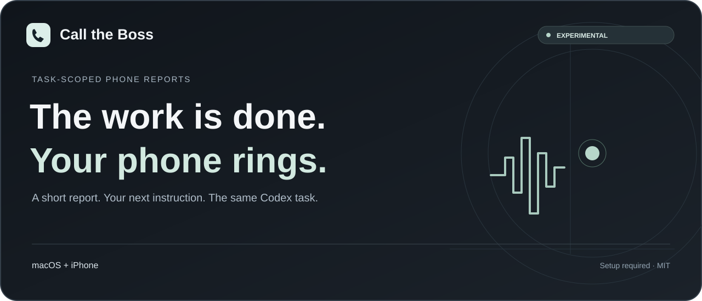

<p align="center"></p>

<p align="center"><strong>English</strong> · <a href="docs/README.zh-CN.md">简体中文</a> · <a href="docs/README.ru.md">Русский</a> · <a href="docs/README.ja.md">日本語</a> · <a href="docs/README.ko.md">한국어</a></p>

<p align="center"><a href="dist/codex-call-the-boss.skill.zip">Download the skill</a> · <a href="#get-started">Get started</a> · <a href="#current-limits">Current limits</a> · <a href="docs/ROADMAP.md">Roadmap / 路线图 / План / ロードマップ / 로드맵</a> · <a href="LICENSE">MIT</a></p>

# Call the Boss

Let Codex call you when the work is done. Get a brief update, ask questions, and give your next task by phone—all connected to the original Codex task.

**Experimental · macOS + iPhone · Explicit per-task opt-in**

| macOS + iPhone | Windows | Linux |
| :-- | :-- | :-- |
| Local skill; setup required | Not supported | Not supported |

Use the calling features already on your Mac and iPhone—no extra mobile app needed. Codex guides you through the initial setup.

## How it works

1. Codex finishes work in an enabled task and prepares a short spoken report.
2. Your Mac places one call using iPhone call relay. After pickup and your greeting, it plays that report.
3. Ask questions normally. Recognition and answers use your existing Codex login; the selected speech renderer supplies the voice.
4. Give one next task. Its original words return to the **same task**, where Codex executes within its normal permissions.
5. When that work finishes, the next completion can trigger one new call.

Work assigned by phone returns to your original Codex task. Open that task anytime to check progress and results.

## Get started

### Another task on your configured Mac

Download the [skill ZIP](dist/codex-call-the-boss.skill.zip), attach it to the target Codex task, and say:

> Read the attached SKILL.md. Reuse this Mac's existing phone configuration and enable completion calls and phone commands only for this task. Check readiness first; guide me through anything missing. Do not change other tasks' subscriptions.

If the skill is already installed, invoke `$codex-call-the-boss` with that request. Only tasks you explicitly enable will call you. Finish any calls and wait for pending work before updating or reconfiguring.

### A new Mac

You need Phone.app, a signed-in Codex desktop app, Python 3.11+, iPhone call relay, a reachable receiving number different from the outgoing line, BlackHole 2ch/16ch, and the necessary Accessibility permissions. The target number must have an identifiable Call action in Phone.app's recents. The Mac and Codex must remain awake and running.

Extract the ZIP and ask Codex to read its `SKILL.md` and guide setup. Codex asks for your approval before installing components, changing permissions, or enabling a paid voice service.

For a read-only inventory, from the extracted `codex-call-the-boss` folder:

```bash
python3 scripts/call_the_boss.py plan
```

Ask Codex to check the configuration and enable calls for the current task. Start with a test call to check that you can hear the report and send an instruction. See the [setup guide](skills/codex-call-the-boss/references/setup.md) for details.

## Voice and costs

- Recognition and answers use the signed-in Codex account and its limits; no OpenAI API key is required by this path.
- Calls use your existing mobile service. This is not a promise of free calls or unlimited account usage.
- System speech is the default. Optional Doubao TTS can incur separate charges and requires your own credentials and approval. Its integration pins **Doubao speech synthesis 2.0 / `seed-tts-2.0`**; see [Doubao setup](skills/codex-call-the-boss/references/doubao.md).
- No credentials, phone numbers, login sessions, voice caches, or call recordings are distributed.

## Current limits

- **Experimental; not intended for critical workflows that depend on phone notifications.** Try it on your own devices first.
- Keep your Mac and Codex running and awake. The phone-command window lasts up to 8 minutes by default, with one execution command per call. To cancel a submitted command, return to the original task.
- Delivery does not mean execution has started. If the call cannot confirm execution status, check progress in the original task.
- One call attempt per completion, with no automatic redial. Ask Codex to try again if you miss a call or it fails.
- Call quality depends on your network, devices, Codex version, and account limits. Documentation is available in five languages; test your preferred spoken language before relying on it.
- The receiving person is not authenticated. Do not use shared or forwarded numbers for unattended sensitive commands.
- Phone records remain in local private state until the owner removes them; no automatic retention policy is implied. Do not upload that state directory.
- Phone instructions use the tools and permissions of the original task. Actions requiring additional approval still need your confirmation.

## Develop and report problems

The reusable skill is under [`skills/codex-call-the-boss`](skills/codex-call-the-boss). Its runtime and tests are under `assets/runtime`. [Development, validation, and packaging](docs/DEVELOPMENT.md) describes the no-call checks. [Security guidance](SECURITY.md) explains what **not** to put in an issue.

Bug reports, suggestions, and translation improvements are welcome.

## License and attribution

Licensed under [MIT](LICENSE). External dependencies and vendor examples have their own terms; see [third-party notices](THIRD_PARTY_NOTICES.md). This is an independent project, not an official OpenAI, Apple, or ByteDance product.
