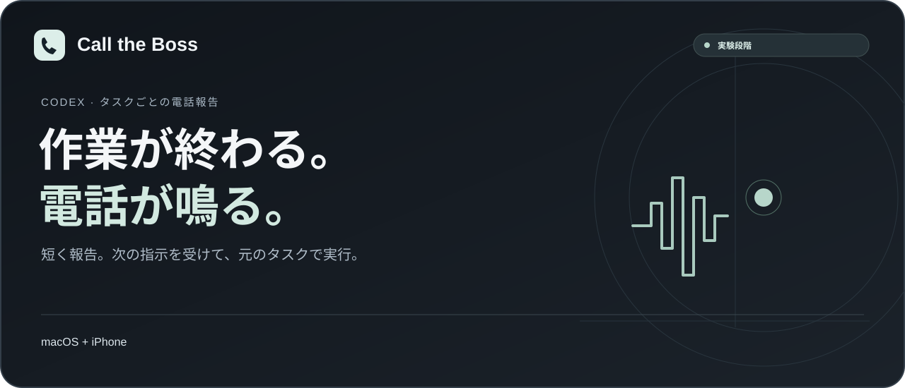

<p align="center"></p>

<p align="center"><a href="../README.md">English</a> · <a href="README.zh-CN.md">简体中文</a> · <a href="README.ru.md">Русский</a> · <strong>日本語</strong> · <a href="README.ko.md">한국어</a></p>

<p align="center"><a href="../dist/codex-call-the-boss.skill.zip">スキルをダウンロード</a> · <a href="#使い始める">セットアップ</a> · <a href="#現在の制限">制限事項</a> · <a href="ROADMAP.md">ロードマップ</a> · <a href="../LICENSE">MIT</a></p>

# Call the Boss

Codex の作業が終わったら、電話で短く報告。質問したり、次の作業を声で指示したりできます。指示は**元の Codex タスク**に戻って実行されます。

**実験段階 · macOS + iPhone · タスクごとに明示的に有効化**

| macOS + iPhone | Windows | Linux |
| :-- | :-- | :-- |
| ローカルスキル・初期設定が必要 | 非対応 | 非対応 |

Mac と iPhone の通話機能を使うので、スマートフォンに追加のアプリは不要です。初回の設定は Codex が案内します。

## 動作の流れ

1. 有効化したタスクが作業を終え、電話専用の短い報告文を準備します。
2. Mac が iPhone の通話連係を使って1回発信。応答して挨拶すると報告を再生します。
3. 通常の質問ができます。音声認識と回答はログイン済み Codex、読み上げは選択した音声エンジンが担当します。
4. 次の指示を1件伝えると、その原文が元のタスクに戻り、通常の権限の範囲で実行されます。
5. その作業が完了すると、次の報告電話につながります。

電話で依頼した作業は元の Codex タスクで進みます。進捗や結果は、いつでもタスクの画面で確認できます。

## 使い始める

### 設定済みの Mac で別のタスクに使う

[スキルの ZIP](../dist/codex-call-the-boss.skill.zip) を対象タスクに添付し、次のように依頼してください。

> 添付の SKILL.md を読んでください。この Mac の既存の電話設定を再利用し、現在のタスクだけに完了報告電話と電話からの指示を有効化してください。先に準備状態を確認し、不足する設定を案内してください。他のタスクの登録は変更しないでください。

インストール済みなら `$codex-call-the-boss` と上記の依頼でも使えます。電話がかかるのは、自分で有効にしたタスクだけです。更新や再設定は、通話と待機中の処理が終わってから行ってください。

### 新しい Mac

Phone.app、ログイン済み Codex デスクトップ、Python 3.11+、iPhone の通話連係、発信回線と異なる着信番号、BlackHole 2ch/16ch、必要なアクセシビリティ権限が必要です。Phone.app の履歴には、対象番号と識別できる発信アクションが必要です。Mac と Codex は起動したまま、スリープさせずに使用します。

ZIP を展開し、Codex に `SKILL.md` を読ませて設定を進めてください。必要なソフトウェアのインストール、権限の変更、有料音声サービスの利用前には、Codex が同意を求めます。

展開した `codex-call-the-boss` フォルダー内で、変更を加えない確認ができます。

```bash
python3 scripts/call_the_boss.py plan
```

Codex に設定の確認と現在のタスクでの電話報告の有効化を依頼してください。まず試しに電話をかけ、報告が聞こえることと指示を伝えられることを確認しましょう。詳しくは[設定手順](../skills/codex-call-the-boss/references/setup.md)をご覧ください。

## 音声と料金

認識と回答には現在の Codex ログインと利用枠を使用し、この経路で OpenAI API Key は不要です。電話は自分の携帯回線を使用するため、無料・無制限とは限りません。標準はシステム音声です。任意の Doubao TTS は自分の認証情報と費用への同意が必要で、モデルは **Doubao speech synthesis 2.0 / `seed-tts-2.0`** に固定されています。[音声設定](../skills/codex-call-the-boss/references/doubao.md)を参照してください。

配布物に電話番号、キー、ログイン情報、音声キャッシュ、通話録音は含みません。

## 現在の制限

- **実験段階のため、電話通知が不可欠な重要業務には向いていません。** まずはご自身の環境でお試しください。
- Mac と Codex を起動したまま、スリープさせずに使用してください。電話から指示を受け付ける時間は既定で最大8分、実行指示は1通話につき1件です。送信済みの指示を取り消す場合は元のタスクに戻ってください。
- 指示の到達と実行開始は異なります。電話で実行状況を確認できなかった場合は、元のタスクで進捗をご確認ください。
- 完了ごとに発信は1回で、自動再発信はありません。不在着信や発信失敗の場合は、Codex に再試行を依頼できます。
- 通話品質はネットワーク、機器、Codex のバージョン、アカウントの利用枠に左右されます。ドキュメントは5言語で提供しています。会話に使う言語は、事前に試し通話でご確認ください。
- 着信者の本人確認はありません。共有・転送番号で機密性の高い作業を無人実行しないでください。
- 記録は所有者が削除するまでローカルに残り、自動保存期限はありません。プライベートな状態ディレクトリを公開しないでください。
- 電話からの指示には元のタスクのツールと権限を使います。追加の許可が必要な操作には、引き続き利用者の確認が必要です。

## 開発とライセンス

スキルは [`skills/codex-call-the-boss`](../skills/codex-call-the-boss)、コードとテストはその `assets/runtime` にあります。[開発・検証・パッケージ化](DEVELOPMENT.md)、[安全な問題報告](../SECURITY.md)、[第三者に関する注記](../THIRD_PARTY_NOTICES.md)を参照してください。不具合の報告、ご提案、翻訳の改善を歓迎します。

[MIT ライセンス](../LICENSE)で公開しています。外部依存関係と提供元のサンプルにはそれぞれの条件が適用されます。OpenAI、Apple、ByteDance の公式製品ではありません。
