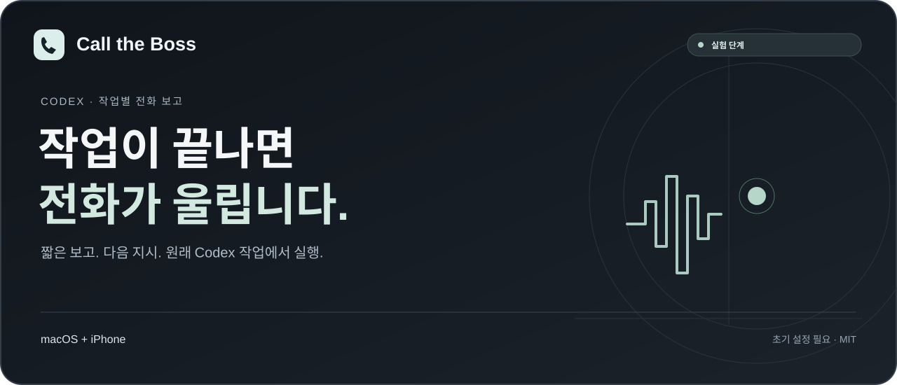

<a href="../README.md">English</a> · <a href="README.zh-CN.md">简体中文</a> · <a href="README.ru.md">Русский</a> · <a href="README.ja.md">日本語</a> · <strong>한국어</strong>

<a href="../dist/codex-call-the-boss.skill.zip">스킬 다운로드</a> · <a href="#시작하기">설정</a> · <a href="#현재-제한">제한 사항</a> · <a href="ROADMAP.md">로드맵</a> · <a href="../LICENSE">MIT</a>

# Call the Boss

Codex가 작업을 끝내면 전화로 짧게 보고합니다. 질문하거나 다음 작업을 말로 지시할 수 있으며, 명령은 **원래 Codex 작업**으로 돌아가 실행됩니다.

**실험 단계 · macOS + iPhone · 작업별 명시적 활성화**

| macOS + iPhone | Windows | Linux |
| :-- | :-- | :-- |
| 로컬 스킬, 초기 설정 필요 | 지원하지 않음 | 지원하지 않음 |

Mac과 iPhone의 기존 통화 기능을 사용하므로 휴대전화에 별도 앱을 설치할 필요가 없습니다. 처음 사용할 때 Codex가 설정을 안내합니다.

## 작동 방식

1. 활성화된 작업이 완료되면 전화에 맞는 짧은 보고문을 준비합니다.
2. Mac이 iPhone 통화 연계를 통해 한 번 발신합니다. 전화를 받고 인사하면 보고를 재생합니다.
3. 일반적인 질문을 할 수 있습니다. 인식과 답변은 로그인된 Codex가, 읽어주는 음성은 선택한 엔진이 담당합니다.
4. 다음 작업 하나를 지시하면 원문이 원래 작업으로 전달되어 통상적인 권한 범위에서 실행됩니다.
5. 그 작업이 끝나면 다음 보고 전화를 할 수 있습니다.

전화로 맡긴 일은 원래 Codex 작업에서 진행됩니다. 언제든 해당 작업을 열어 진행 상황과 결과를 확인할 수 있습니다.

## 시작하기

### 1. 기기 준비하기

Phone.app이 있는 Mac, 로그인된 Codex 데스크톱 앱, 통화 연계가 활성화된 iPhone이 필요합니다. 전화를 받을 번호는 발신 회선과 달라야 합니다.

Python 3.11+, BlackHole 2ch/16ch, 손쉬운 사용 권한도 필요합니다. Codex가 확인하고 부족한 설정을 안내합니다. Phone.app 최근 통화에 수신 번호와 사용 가능한 발신 버튼이 있어야 합니다. 사용 중에는 Mac과 Codex를 실행 상태로 유지하고 잠자기 상태로 두지 마세요.

### 2. 다운로드하고 Codex와 설정하기

[스킬 ZIP](../dist/codex-call-the-boss.skill.zip)을 다운로드해 압축을 풀고, Codex가 `codex-call-the-boss` 폴더를 읽을 수 있도록 한 뒤 다음과 같이 요청하세요.

> Call the Boss를 처음 사용합니다. 이 폴더의 SKILL.md를 읽고 제 기기와 환경을 확인한 뒤 설치, iPhone 통화 연계, 수신 번호, 오디오, 권한 설정을 안내해 주세요. 전화 설정이 이미 되어 있다고 가정하지 마세요. 프로그램 설치, 권한 변경, 유료 서비스 사용 전에는 동의를 구해 주세요. 설정이 끝나면 현재 작업에만 전화 보고를 활성화하고, 시험 전화는 제가 확인한 뒤에 걸어 주세요.

Codex의 안내에 따라 설정하면 됩니다. 코드의 매개변수를 직접 수정할 필요는 없습니다. 자세한 내용은 [설정 안내](../skills/codex-call-the-boss/references/setup.md)를 참고하세요.

### 3. 시험 통화하기

설정 확인이 끝나면 Codex에게 시험 전화를 한 번 걸어 달라고 요청하세요. 전화를 받고 인사한 뒤 보고가 잘 들리는지 확인하고, 질문과 간단한 작업 지시를 해 보세요. 원래 작업 창에서 지시가 전달되고 실행되었는지 확인하세요.

### 다른 작업에서도 사용하기

최초 설치를 마친 뒤, 전화 보고를 받을 Codex 작업에서 다음과 같이 요청하세요.

> $codex-call-the-boss를 사용해 저장된 설정을 확인하고 현재 작업에만 완료 보고 전화와 전화 명령을 활성화해 주세요. 부족한 설정을 안내하되 다른 작업의 설정은 바꾸지 마세요.

각 작업에서 따로 활성화해야 합니다. 업데이트하거나 다시 설정하기 전에는 통화를 마치고 대기 중인 처리가 끝날 때까지 기다려 주세요.

## 음성과 비용

인식과 답변은 현재 Codex 로그인 및 사용 한도를 이용하며, 이 경로에는 OpenAI API Key가 필요하지 않습니다. 통화는 본인의 휴대전화 요금제를 사용하므로 무료·무제한을 보장하지 않습니다. 기본값은 시스템 음성입니다. 선택 사항인 Doubao TTS는 본인 인증 정보와 비용 동의가 필요하며 **Doubao speech synthesis 2.0 / `seed-tts-2.0`** 모델을 고정 사용합니다. [음성 설정](../skills/codex-call-the-boss/references/doubao.md)을 참고하세요.

배포 파일에는 전화번호, 키, 로그인 세션, 음성 캐시, 통화 녹음이 포함되지 않습니다.

## 현재 제한

- **실험 단계이며, 전화 알림에 의존하는 중요한 업무에는 적합하지 않습니다.** 먼저 본인의 기기에서 시험해 보세요.
- Mac과 Codex를 실행하고 잠자기 상태로 두지 마세요. 전화 명령을 받는 시간은 기본 최대 8분이며 통화당 실행 명령 하나를 보낼 수 있습니다. 전송한 명령을 취소하려면 원래 작업으로 돌아가세요.
- 명령 전달이 실행 시작을 의미하지는 않습니다. 전화에서 실행 상태를 확인하지 못했다면 원래 작업에서 진행 상황을 확인하세요.
- 작업 완료마다 한 번만 발신하며 자동으로 재발신하지 않습니다. 전화를 놓쳤거나 발신에 실패했다면 Codex에게 다시 시도해 달라고 요청하세요.
- 통화 품질은 네트워크, 기기, Codex 버전, 계정 한도에 따라 달라집니다. 문서는 5개 언어로 제공됩니다. 대화에 사용할 언어는 미리 시험 통화로 확인하세요.
- 수신자의 신원을 인증하지 않습니다. 공용·착신 전환 번호로 민감한 작업을 무인 실행하지 마세요.
- 기록은 소유자가 삭제할 때까지 로컬에 보관되며 자동 보존 기간은 설정되지 않습니다. 비공개 상태 폴더를 업로드하지 마세요.
- 전화 명령은 원래 작업의 도구와 권한을 사용합니다. 추가 권한이 필요한 작업은 여전히 사용자의 확인을 받아야 합니다.

## 개발 및 라이선스

스킬은 [`skills/codex-call-the-boss`](../skills/codex-call-the-boss), 코드와 테스트는 그 안의 `assets/runtime`에 있습니다. [개발·검증·패키징](DEVELOPMENT.md), [보안 안내](../SECURITY.md), [제삼자 고지](../THIRD_PARTY_NOTICES.md)를 참고하세요. 오류 제보, 제안, 번역 개선을 환영합니다.

[MIT 라이선스](../LICENSE)로 공개합니다. 외부 의존성과 공급자 예제에는 각각의 조건이 적용됩니다. OpenAI, Apple, ByteDance의 공식 제품이 아닌 독립 프로젝트입니다.
