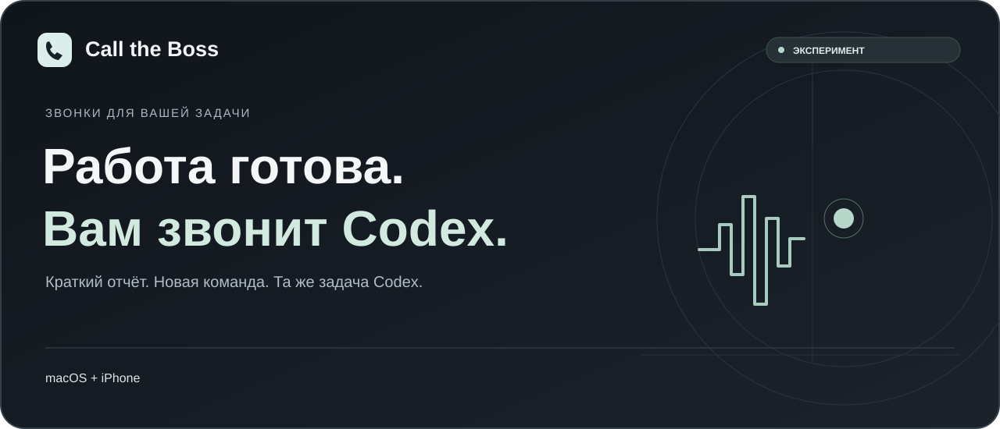

<a href="../README.md">English</a> · <a href="README.zh-CN.md">简体中文</a> · <strong>Русский</strong> · <a href="README.ja.md">日本語</a> · <a href="README.ko.md">한국어</a>

<a href="../dist/codex-call-the-boss.skill.zip">Скачать навык</a> · <a href="#начало-работы">Настройка</a> · <a href="#ограничения">Ограничения</a> · <a href="ROADMAP.md">План развития</a> · <a href="../LICENSE">MIT</a>

# Call the Boss

Codex звонит, когда работа закончена: кратко сообщает результат, отвечает на вопросы и принимает следующую задачу. Команда возвращается в **исходную задачу Codex** для выполнения.

**Экспериментальный проект · macOS + iPhone · Включение отдельно для каждой задачи**

| macOS + iPhone | Windows | Linux |
| :-- | :-- | :-- |
| Локальный навык, нужна настройка | Не поддерживается | Не поддерживается |

Используйте функции звонков вашего Mac и iPhone — отдельное приложение на телефоне не нужно. Codex поможет выполнить первоначальную настройку.

## Как это работает

1. Подключённая задача завершает работу и готовит краткий текст для звонка.
2. Mac делает одну попытку звонка через iPhone. После ответа и приветствия воспроизводится отчёт.
3. Можно задавать вопросы. Распознавание и ответы используют текущую учётную запись Codex, озвучивание — выбранный голосовой движок.
4. Одна новая команда передаётся дословно в исходную задачу. Она выполняется в рамках обычных разрешений Codex.
5. Завершение этой работы может вызвать следующий звонок.

Поручения по телефону возвращаются в исходную задачу Codex. В любой момент откройте её, чтобы посмотреть ход работы и результат.

## Начало работы

### 1. Подготовьте устройства

Нужны Mac с Phone.app, приложение Codex с выполненным входом и iPhone с включённой передачей вызовов на Mac. Для приёма звонков нужен номер, отличный от исходящей линии.

Также потребуются Python 3.11+, BlackHole 2ch/16ch и разрешения специальных возможностей. Codex проверит их и поможет настроить недостающее. Номер получателя должен быть в недавних вызовах Phone.app с доступной кнопкой вызова. Во время использования Mac и Codex должны работать без перехода в сон.

### 2. Скачайте навык и настройте его с Codex

Скачайте [ZIP навыка](../dist/codex-call-the-boss.skill.zip), распакуйте его, предоставьте Codex доступ к папке `codex-call-the-boss` и напишите:

> Я впервые использую Call the Boss. Прочитай SKILL.md в этой папке, проверь мои устройства и помоги установить и настроить передачу вызовов через iPhone, номер получателя, звук и разрешения. Не предполагай, что телефон уже настроен. Запроси согласие перед установкой компонентов, изменением разрешений или подключением платных услуг. После настройки включи телефонные отчёты только для текущей задачи. Не звони до моего подтверждения.

Следуйте подсказкам Codex — самостоятельно менять параметры в коде не нужно. Подробности — в [руководстве по настройке](../skills/codex-call-the-boss/references/setup.md).

### 3. Сделайте пробный звонок

После успешной проверки попросите Codex позвонить один раз для теста. Ответьте и поздоровайтесь. Проверьте отчёт, задайте вопрос и поручите простую задачу. Откройте исходную задачу и убедитесь, что команда получена и выполнена.

### Использование в других задачах

После первоначальной установки отправьте в нужной задаче Codex:

> Используй $codex-call-the-boss. Проверь сохранённые настройки и включи звонки о завершении и телефонные команды только для текущей задачи. Помоги настроить недостающее, не меняя настройки других задач.

Каждая задача подключается отдельно. Перед обновлением или перенастройкой завершите звонки и дождитесь окончания ожидающих заданий.

## Голос и расходы

Распознавание и ответы используют текущий вход Codex и его лимиты, без отдельного OpenAI API Key. Звонки идут через ваш мобильный тариф; бесплатность и неограниченное использование не обещаются. По умолчанию используется системный голос. Необязательный Doubao TTS требует собственных ключей и согласия на возможные расходы; модель закреплена как **Doubao speech synthesis 2.0 / `seed-tts-2.0`**. См. [инструкцию Doubao](../skills/codex-call-the-boss/references/doubao.md).

В архиве нет номеров телефонов, ключей, сеансов входа, голосового кэша или записей звонков.

## Ограничения

- **Экспериментальный проект, не для критичных процессов, зависящих от телефонных уведомлений.** Сначала попробуйте на своих устройствах.
- Mac и Codex должны оставаться включёнными и не переходить в сон. Окно приёма команд по умолчанию длится до 8 минут; за звонок можно передать одну команду. Для отмены отправленной команды вернитесь в исходную задачу.
- Доставка команды не означает начало выполнения. Если по телефону статус не подтверждён, проверьте его в исходной задаче.
- На каждое завершение — одна попытка звонка без автоматического повтора. Если вы пропустили звонок или он не удался, попросите Codex повторить.
- Качество звонка зависит от сети, устройств, версии Codex и лимитов аккаунта. Документация доступна на пяти языках; разговор на нужном языке сначала проверьте пробным звонком.
- Личность отвечающего не проверяется. Не используйте общие или переадресованные номера для чувствительных задач без присмотра.
- Записи хранятся локально до удаления владельцем; автоматический срок хранения не установлен. Не публикуйте приватный каталог состояния.
- Команды по телефону используют инструменты и разрешения исходной задачи. Действия с дополнительными разрешениями по-прежнему требуют вашего подтверждения.

## Разработка и лицензия

Навык: [`skills/codex-call-the-boss`](../skills/codex-call-the-boss), код и тесты: `assets/runtime`. См. [разработку и упаковку](DEVELOPMENT.md), [безопасность](../SECURITY.md) и [сторонние компоненты](../THIRD_PARTY_NOTICES.md). Приветствуются сообщения об ошибках, предложения и улучшения переводов. Не публикуйте личные данные.

Проект распространяется по лицензии [MIT](../LICENSE). Внешние зависимости и примеры поставщиков имеют собственные условия. Это независимый проект, не официальный продукт OpenAI, Apple или ByteDance.
