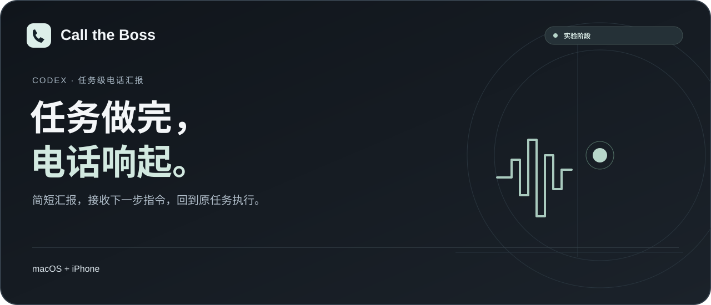

<a href="../README.md">English</a> · <strong>简体中文</strong> · <a href="README.ru.md">Русский</a> · <a href="README.ja.md">日本語</a> · <a href="README.ko.md">한국어</a>

<a href="../dist/codex-call-the-boss.skill.zip">下载 Skill</a> · <a href="#开始使用">开始使用</a> · <a href="#当前限制">当前限制</a> · <a href="ROADMAP.md">开发路线</a> · <a href="../LICENSE">MIT 许可证</a>

# Call the Boss · 让 Codex 打电话汇报

不用一直守着任务窗口。Codex 做完工作，打电话简短汇报；你可以问问题，也可以直接说下一步要做什么。指令回到**原来的任务**执行。

**实验性项目 · macOS + iPhone · 每个任务单独启用**

| macOS + iPhone | Windows | Linux |
| :-- | :-- | :-- |
| 本地技能，需要首次配置 | 暂不支持 | 暂不支持 |

使用 Mac 和 iPhone 现有的电话功能，无需在手机上安装额外 App。首次使用时，Codex 会引导你完成配置。

## 使用流程

1. 已启用的 Codex 任务完成工作，生成一段专门用于电话的简短汇报。
2. Mac 通过 iPhone 电话接力拨打一次。接听并说“喂”后，播放汇报。
3. 正常问答。识别和回答使用已登录的 Codex，配音由所选语音服务提供。
4. 下达下一条任务，原始指令返回原任务，在正常权限范围内执行。
5. 新任务完成，再进行一次电话汇报。

电话里交代的工作会回到原来的 Codex 任务，你可以随时回到任务窗口查看进度和结果。

## 开始使用

### 1. 准备设备

你需要一台带有 Phone.app 的 Mac、已登录的 Codex 桌面端，以及开启电话接力的 iPhone。还需要一个用于接听的号码，不能与拨出电话的线路相同。

配置时还需要 Python 3.11+、BlackHole 2ch/16ch 和辅助功能权限，Codex 会逐项检查并引导你补齐。Phone.app 最近通话中需有接听号码及可用的“呼叫”按钮。使用期间，Mac 和 Codex 要保持运行、不要休眠。

### 2. 下载并让 Codex 带你配置

下载 [Skill 压缩包](../dist/codex-call-the-boss.skill.zip)，解压后，将其中的 `codex-call-the-boss` 文件夹交给 Codex，并发送：

> 我是第一次使用 Call the Boss。请读取这个文件夹里的 SKILL.md，先检查我的设备和环境，再引导我完成安装、电话接力、接听号码、音频和权限配置。不要假设我已有任何电话配置。安装组件、修改权限或启用收费服务前先征求我的同意。配置完成后，仅为当前任务启用电话汇报，不要直接拨号，等我确认后再试打。

无需自行填写代码里的参数，按 Codex 的提示完成设置即可。详细步骤见[配置说明](../skills/codex-call-the-boss/references/quick-start-zh.md)。

### 3. 试打一通

配置检查通过后，对 Codex 说“打给我测试一次”。接听后说“喂”，确认能听清汇报、正常问答，并试着下达一条简单任务。回到任务窗口检查是否收到并执行了指令。

### 以后在其他任务中使用

完成首次安装后，在需要电话汇报的 Codex 任务里发送：

> 使用 $codex-call-the-boss，检查已保存的配置，仅为当前任务启用完成电话汇报和电话指令。缺少配置时请引导我补齐，不要改变其他任务的设置。

每个任务都需要单独启用。更新或重新配置前，请先结束通话并等待待处理任务完成。

## 声音与费用

- 识别和回答走当前 Codex 登录及其额度，这条路径不要求 OpenAI API Key。
- 通话使用自己的手机线路，是否收费取决于套餐；不承诺无限额度或免费电话。
- 默认使用系统语音。可选豆包配音需自行提供凭据、同意潜在费用，固定使用 **Doubao-语音合成-2.0 / `seed-tts-2.0`**，详见[配音配置](../skills/codex-call-the-boss/references/doubao.md)。
- 分享包不包含号码、密钥、账户登录、配音缓存或通话录音。

## 当前限制

- **目前处于实验阶段，暂不适合依赖电话通知的关键业务。** 请先在自己的设备上试用。
- Mac 和 Codex 必须保持运行且未休眠。电话指令接收窗口默认最长 8 分钟，每通电话最多提交一条执行指令；提交后如需取消，请回到原任务处理。
- 指令送达不代表已经开始执行。电话中若提示状态尚未确认，请在原任务窗口查看进度。
- 每次任务完成只拨打一次；未接通或呼叫失败时不会自动重拨，需要时可让 Codex 再试一次。
- 通话体验受网络、设备、Codex 版本及账户额度影响。文档提供五种语言；其他语言的通话效果请在使用前试听确认。
- 不认证接听者身份，不适合共享或转接号码上的无人值守敏感任务。
- 通话记录保存在本机私有目录，直到用户自行清理；未提供自动保留期限。不要上传该目录。
- 电话指令使用原任务已有的工具和权限；需要额外授权的操作仍需你确认。

## 开发与反馈

技能位于 [`skills/codex-call-the-boss`](../skills/codex-call-the-boss)，代码和测试在其 `assets/runtime` 下。参阅[开发、验证与打包](DEVELOPMENT.md)以及[安全说明](../SECURITY.md)。提交问题时不要附带私人配置或完整通话记录。

欢迎提交问题、建议和翻译改进。本项目采用 [MIT 许可证](../LICENSE)；第三方组件详见[第三方说明](../THIRD_PARTY_NOTICES.md)。本项目并非 OpenAI、Apple 或字节跳动官方产品。
